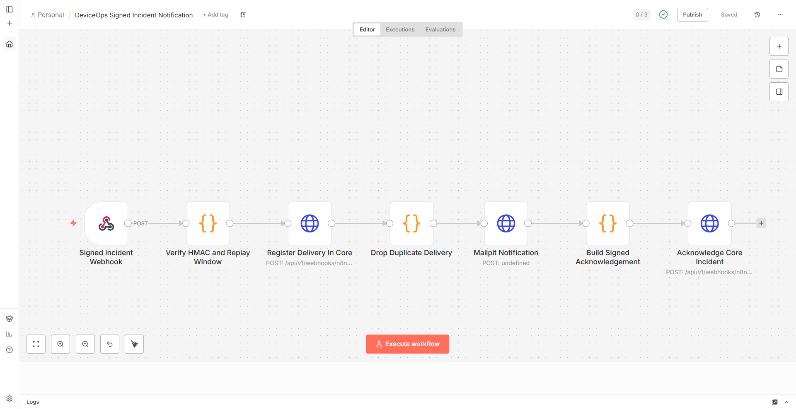
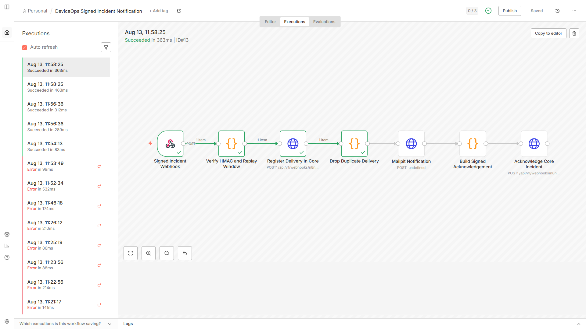
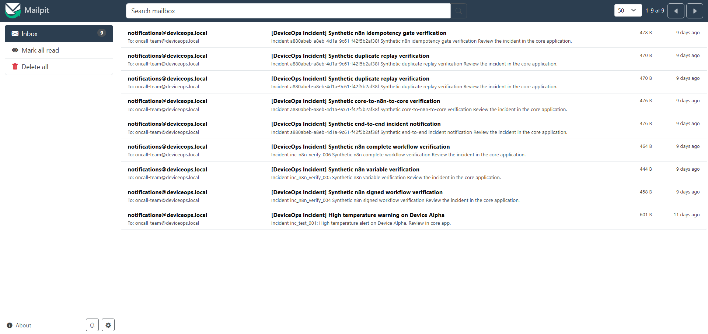
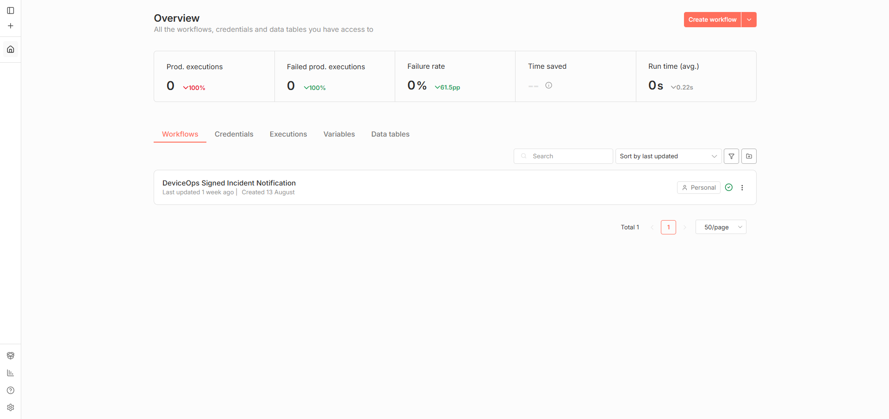

# DeviceOps Automations — Incident Resolution & Orchestration Workflows

Version-controlled n8n integration adapter for the DeviceOps autonomous operations & incident resolution platform. Core authorization, incident state, idempotency, and audit truth remain in `deviceops-ai-copilot`.

> Source available for portfolio review; all rights reserved; no permission to reuse or redistribute.

## Overview

This repository contains version-controlled n8n workflows that handle external integration tasks:
1. Receiving a signed incident envelope from core `deviceops-ai-copilot`.
2. Verifying HMAC-SHA256 signature, timestamp, nonce, and delivery ID.
3. Sending notifications via Mailpit SMTP server to the on-call team.
4. Posting a signed acknowledgement back to core `/api/v1/webhooks/n8n/ack`.
5. Error handling and dead-letter routing for transient notification failures.

## Connected Repositories

- 🖥️ **Core Monorepo**: [github.com/U7ama/deviceops-ai-copilot](https://github.com/U7ama/deviceops-ai-copilot) — Core Next.js 16 platform, pgvector RAG, pg-boss worker, and MCP adapter.
- 📱 **Mobile Companion App**: [github.com/U7ama/deviceops-mobile](https://github.com/U7ama/deviceops-mobile) — Expo SDK 56 technician client with offline cache.
- ⚡ **Automations Adapter (`deviceops-automations`)**: Current repository (n8n incident workflows).

The exported workflow is an enterprise integration contract. After importing into your n8n instance, configure these n8n project variables (or equivalent secret-backed variables): `N8N_WEBHOOK_SECRET`, `MAILPIT_API_URL` (for example, `http://host.docker.internal:8025/api/v1/send`), `DEVICEOPS_CORE_URL` (for example, `http://host.docker.internal:3000`), `ALERT_FROM`, and `ALERT_RECIPIENT`. The workflow uses `$vars` rather than unrestricted process environment access, which is compatible with n8n v2 task-runner restrictions. The workflow must never contain fallback URLs, recipient addresses, secrets, or credentials in JSON.

For the local Compose stack, set the same secret in `N8N_WEBHOOK_SECRET` before starting n8n, then create `N8N_WEBHOOK_SECRET`, `DEVICEOPS_CORE_URL`, `MAILPIT_API_URL`, `ALERT_FROM`, and `ALERT_RECIPIENT` as n8n project variables or through deployment automation. The workflow intentionally has no URL, recipient, sender, or secret fallbacks: missing variables must fail configuration rather than silently route to a local address. The signed envelope must use a UUID `deliveryId`, a timestamp within five minutes, a unique nonce, and an HMAC-SHA256 signature over `timestamp.nonce.payloadBase64`. Test the production webhook URL only after the workflow is active; the test URL is a separate n8n endpoint.

## Visual Architecture & Execution Evidence

| n8n Incident Notification Canvas | Execution Trace & Dead-Letter Log |
| :---: | :---: |
|  |  |

| Mailpit Incident Alert Dispatch | n8n Workflows Registry |
| :---: | :---: |
|  |  |

## Contract Synchronization

```bash
npm run verify
```

Validates that `contracts/contract-manifest.json` is present and matches the core contract version hash.

## Autonomous operations notification (v2)

`workflows/operations_notification.json` is the new local hackathon flow: a signed dispatch capability is claimed atomically in the core, sent to local Mailpit, then acknowledged using a signed callback. Import and activate it only in the local n8n instance described by the core repository's `docs/HACKATHON.md`. The existing `incident_notification.json` and screenshots above describe the legacy v1 flow.

Required n8n environment variables: `DEVICEOPS_CORE_URL`, `MAILPIT_API_URL`, `N8N_WEBHOOK_SECRET` (at least 32 characters), `ALERT_FROM`, and `ALERT_RECIPIENT`. The local Compose profile supplies `.test` recipients and enables `crypto` for the acknowledgement Code node. No external email is sent by the supplied profile.

HTTP webhook acceptance is not delivery. Core notification states distinguish acceptance, delivery in progress, delivered, retries, and unknown outcomes. Duplicate claims do not send twice. If a send succeeds but its acknowledgement is lost, inspect Mailpit and reconcile; automatic SMTP replay is deliberately blocked. Notifications never authorize device commands.

This companion is MIT licensed; see `LICENSE`. Run `npm run verify` for the existing shared contract check; the core also includes `scripts/ops-notifications-integration.mts` for v2 signing and database delivery-state checks.

Local n8n 2.0 note: after importing `workflows/operations_notification.json`, save a small node edit in the editor before publishing; CLI import alone does not create the required workflow history. Core claim/ack requests allow 30 seconds for a development cold start. The September 7 local Docker check verified one Mailpit message and a signed acknowledgement; no external recipient was used.
